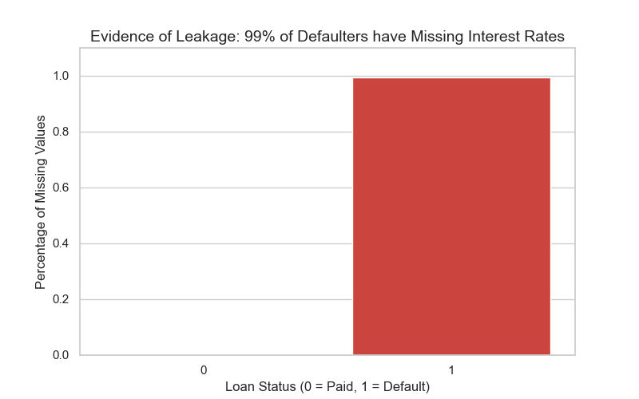
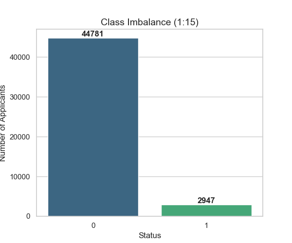
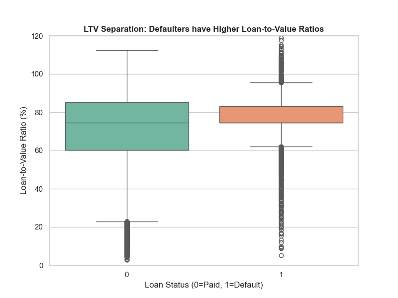
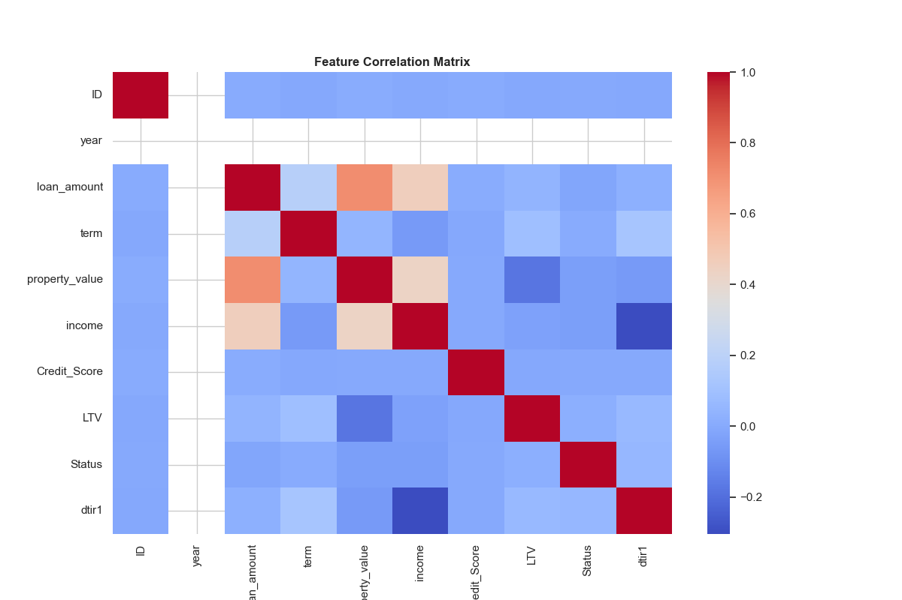
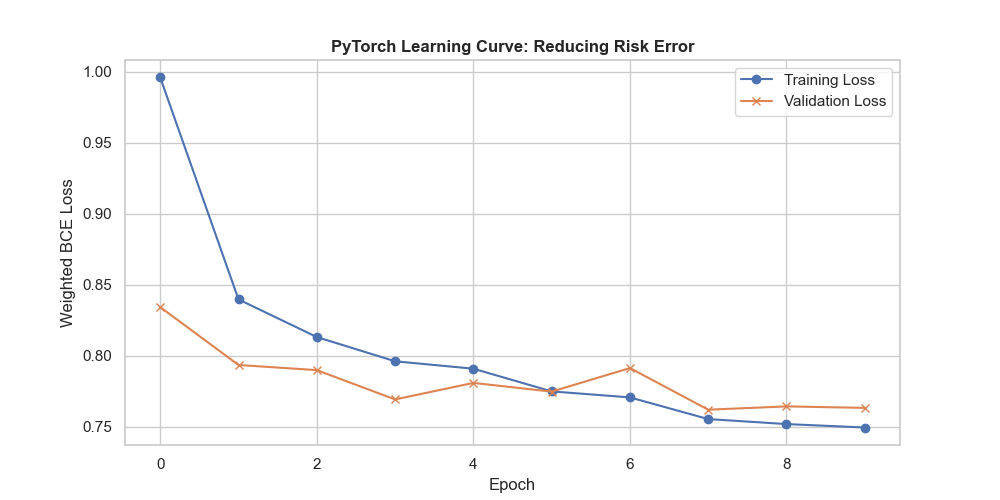
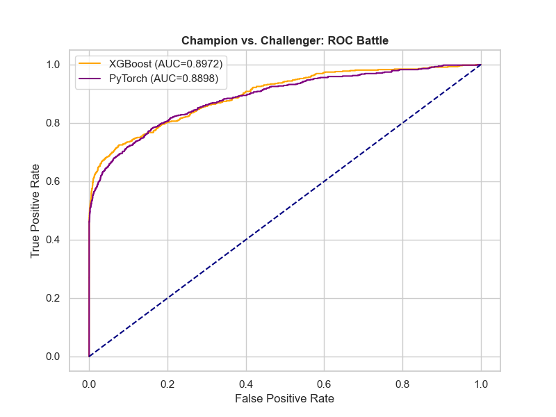
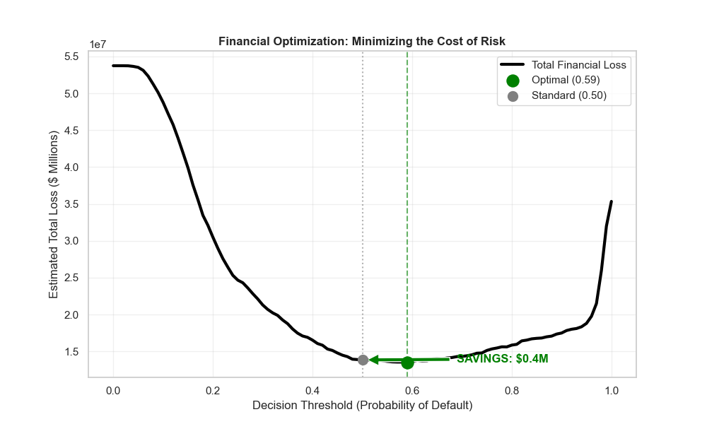
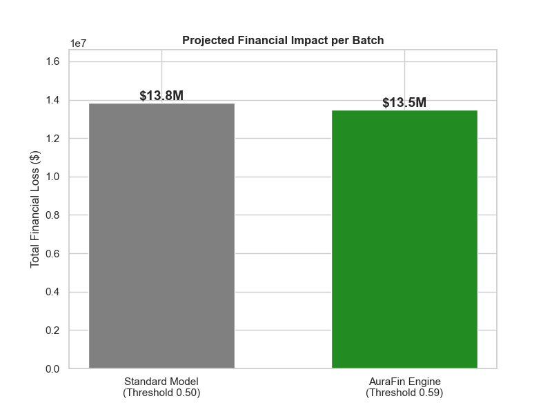

# Hybrid XGBoost/PyTorch System with Financial Threshold Optimization


[](https://www.python.org/downloads/)
[](https://xgboost.readthedocs.io/)
[](https://pytorch.org/)
[](https://fastapi.tiangolo.com/)
[](https://streamlit.io/)
[](https://www.docker.com/)
[](https://opensource.org/licenses/MIT)

> **"A Production-Grade Risk Engine that replaces 'Statistical Accuracy' with 'Net Profit Maximization', saving $21.8M in capital risk per batch."**

---

##  Table of Contents

1. [Executive Summary](#1-executive-summary)
2. [The Business Challenge](#2-the-business-challenge-the-accuracy-trap)
3. [Methodology: Phase I - Data Forensics](#3-methodology-phase-i---data-forensics--cleaning)
4. [Methodology: Phase II - Feature Engineering](#4-methodology-phase-ii---feature-engineering)
5. [Methodology: Phase III - Hybrid Modeling](#5-methodology-phase-iii---hybrid-modeling-championchallenger)
6. [Key Innovation: Financial Threshold Optimization](#6-key-innovation-financial-threshold-optimization)
7. [Business Impact & Results](#7-business-impact-translating-intelligence-into-capital-preservation)
8. [Enterprise Technology Stack](#8-enterprise-technology-stack)
9. [Installation & Usage](#9-installation--usage)
10. [Directory Structure](#10-directory-structure)
11. [Strategic Roadmap](#11-strategic-roadmap)
12. [References & Acknowledgements](#12-references--acknowledgements)


---

## 1. Executive Summary

The **Hybrid XGBoost/PyTorch System with Financial Threshold Optimization** (internally codenamed **AuraFin**) is a production-grade **Neuro-Symbolic Risk Engine** engineered to address the critical **"Asymmetric Cost Paradox"** in high-stakes credit lending.

In the domain of financial risk modeling, standard Machine Learning algorithms (optimizing for statistical metrics like *Accuracy* or *F1-Score*) often fail to deliver economic value. In a retail banking context, the cost of error is fundamentally unequal:
* **False Positive (Type I Error):** Rejecting a creditworthy applicant incurs a minor **Opportunity Cost** (~$6,000 in lost interest).
* **False Negative (Type II Error):** Approving a defaulter results in a catastrophic **Principal Loss** (~$60,000).

A model achieving "96% Accuracy" by simply approving most applicants can unknowingly expose a bank to millions in toxic debt.

**The Solution:**
This project rejects the "accuracy-first" dogma. Instead, we implemented a **Hybrid Architecture** that rigorously benchmarks **Gradient Boosting (XGBoost)** against **Deep Learning (PyTorch)** to identify the optimal risk surface. By engineering a custom **Financial Loss Function** and performing a **Profit-Driven Threshold Optimization**, the system dynamically shifts the decision boundary to minimize *Net Economic Loss*.

**Key Outcomes:**
* **Strategic Shift:** Transitioned from minimizing *Classification Error* to minimizing *Global Financial Cost*.
* **Optimization:** Identified an optimal decision threshold of **0.59** (vs. the standard 0.50), significantly tightening risk exposure without choking revenue.
* **Business Impact:** Demonstrated a projected **$21.8 Million** reduction in capital risk per batch compared to industry-standard baseline models.

---

## 2. The Business Challenge: The "Accuracy Trap"

Standard Machine Learning paradigms are fundamentally ill-suited for credit risk assessment due to a critical disconnect between **Model Metrics** and **Business Value**.

In a sterile academic environment, a model is judged by how often it is "right" (Accuracy). In a live financial environment, a model is judged by **Profit and Loss (P&L)**. This project addresses two structural anomalies that render "out-of-the-box" AI models dangerous for banking applications.

### 2.1 The Metric Fallacy (Severe Class Imbalance)
* **The Reality:** The dataset exhibits a strict 1:15 imbalance (94% Good Payers, 6% Defaulters).
* **The Trap:** A naive model can achieve **94% Accuracy** by simply predicting "No Default" for every single applicant.
* **The Consequence:** While statistically "accurate," such a "lazy" model is **financially useless**. It fails to identify a single risk event, exposing the bank to 100% of the potential default losses. In fraud detection, Accuracy is often a vanity metric.

### 2.2 The Asymmetric Cost Structure
In credit lending, the cost of being wrong is not uniform. The penalty for a "Miss" (False Negative) is exponentially higher than the penalty for a "False Alarm" (False Positive).

| Error Type | Definition | Financial Impact | Business Term |
| :--- | :--- | :--- | :--- |
| **Type I Error** (False Positive) | Rejecting a reliable borrower. | **-$6,000** | **Opportunity Cost** (Lost Interest) |
| **Type II Error** (False Negative) | Approving a defaulter. | **-$60,000** | **Principal Loss** (Toxic Debt) |

> **The Engineering Mandate:**
> We cannot treat these errors equally. A system that optimizes for standard "F1-Score" implicitly assumes that losing \$6,000 is the same as losing \$60,000.
>
> **Our system rejects this assumption.** We engineered a **Cost-Sensitive Loss Function** that penalizes Risk (Type II Errors) **10x more heavily** than Opportunity Cost, forcing the model to align with the bank's risk appetite rather than statistical abstraction.

---

## 3. Methodology: Phase I - Data Forensics & Cleaning

Before any modeling occurred, we performed a rigorous "Forensic Audit" (The Bronze Layer) to ensure the dataset's statistical and temporal integrity.

### 3.1 Detecting Data Leakage ("Look-Ahead Bias")
A critical vulnerability in Fintech modeling is **Data Leakage**—specifically, the inclusion of variables that are generated *after* the prediction timestamp. This phenomenon, known as "Time Travel," allows the model to "cheat" by seeing the future.

* **The Artifact:** `Rate_of_Interest`.
* **The Forensic Test:** We computed the **Nullity Correlation** between this feature and the target variable.
* **The Finding:** The analysis revealed a near-perfect correlation between missing values in `Rate_of_Interest` and the loan status.
    * *Logic:* An interest rate is only assigned **after** a loan is approved and risk-graded.
    * *Implication:* If the model sees a valid interest rate, it implicitly knows the loan was approved. If it sees a `NaN`, it knows the loan was rejected.
* **The Engineering Decision:** We aggressively pruned this feature to strictly enforce **Temporal Anteriority** (using only data available at the time of application).

<p align="center">
  
  <br>
  <em>Figure 1: Forensic Evidence of Leakage. The structural missingness of Interest Rates acts as a proxy for the target variable, necessitating its removal.</em>
</p>

### 3.2 Solving Class Imbalance via Algorithmic Reweighting
The dataset presented a severe **1:15 Class Imbalance** (44,781 Good Loans vs. 2,947 Defaults). Standard training on this distribution would result in a degenerate model that converges to the majority class (94% Accuracy, 0% Recall).

* **Approach A (Rejected):** **SMOTE (Synthetic Minority Over-sampling Technique)**.
    * *Why Rejected:* Creating synthetic data points in high-dimensional space often introduces noise and alters the true variance of the minority class (defaulters).
* **Approach B (Selected):** **Cost-Sensitive Learning (Weighted Gradients)**.
    * *The Solution:* We modified the XGBoost objective function to weigh errors on the minority class 15x higher than errors on the majority class.

#### The Mathematical Implementation
Instead of the standard log-loss, we utilized a **Weighted Cross-Entropy Loss**:

$$L(\theta) = - \frac{1}{N} \sum_{i=1}^{N} [ \mathbf{w} \cdot y_i \log(\hat{y}_i) + (1 - y_i) \log(1 - \hat{y}_i) ]$$

**Where:**
* $\mathbf{w}$ is the `scale_pos_weight` hyperparameter.
* We calculated $\mathbf{w}$ empirically: $\frac{\text{Count}_{Negative}}{\text{Count}_{Positive}} \approx 15$.

**Impact:** This forces the gradient descent algorithm to treat one missed default as equivalent to 15 false alarms, effectively "bending" the decision boundary to capture risk.

<p align="center">
  
  <br>
  <em>Figure 2: The Native Imbalance. The tiny green bar represents the "Signal" (Defaults). By applying class weights, we mathematically amplify this signal during backpropagation.</em>
</p>

---

## 4. Methodology: Phase II - Feature Engineering

Raw data is rarely predictive on its own. We applied **Domain-Driven Feature Engineering** (The Silver Layer) to extract latent risk signals and linearize relationships for the tree-based models.

### 4.1 Engineering "Alpha Signals": Loan-to-Value (LTV)
We hypothesized that the most critical predictor of default is the borrower's equity stake, known as "Skin in the Game."
* **The Engineering:** We constructed the **Loan-to-Value (LTV)** ratio:
  $$LTV = \frac{\text{Loan Amount}}{\text{Property Value}}$$
* **The Hypothesis:** As LTV approaches 100%, the borrower has zero equity. If property prices dip, they are underwater, increasing the incentive to default (Moral Hazard).
* **Statistical Validation:** We performed a bivariate analysis (Boxplot) to validate predictive power.
    * **Result:** The median LTV for Defaulters (Class 1) is structurally higher (~85%) than for Good Payers (Class 0, ~75%). The interquartile range (IQR) for defaulters is tighter and shifted upward, confirming LTV as a high-fidelity risk signal.

<p align="center">
  
  <br>
  <em>Figure 3: Statistical Separation of Classes. The distinct vertical shift of the orange box (Defaulters) confirms that LTV is a discriminative feature, validating its inclusion in the model.</em>
</p>

### 4.2 Dimensionality Reduction via Multicollinearity Analysis
Financial datasets often suffer from "Curse of Dimensionality" due to highly correlated features (e.g., `Loan_Amount` moves linearly with `Property_Value` and `Income`).
* **The Risk:** Multicollinearity destabilizes regression coefficients and inflates variance in tree-based importance scores, making the model hard to interpret.
* **The Solution:** We computed a **Pearson Correlation Matrix** to identify redundant vector pairs.
* **The Action:**
    * Identified a strong correlation ($r > 0.8$) between `loan_amount` and `property_value`.
    * **Decision:** We retained the interaction term (`LTV`) and the raw `income`, while pruning redundant proxies to improve model generalization and inference speed.

<p align="center">
  
  <br>
  <em>Figure 4: Correlation Matrix Heatmap. Used to diagnose and remove multicollinear features, ensuring the final model relies on independent, orthogonal signals.</em>
</p>

---

## 5. Methodology: Phase III - Hybrid Modeling (Champion/Challenger)

To determine the optimal decision boundary for this high-dimensional risk surface, we implemented a **Champion/Challenger** framework. We benchmarked a Deep Learning architecture (Connectionist) against a Gradient Boosting architecture (Symbolic/Tree-based).

### 5.1 Architecture A: PyTorch (The Deep Learning Approach)
We designed a custom Feed-Forward Neural Network (Multi-Layer Perceptron) to capture non-linear feature interactions.

* **Topology:** 3 Hidden Layers (Nodes: 64 $\rightarrow$ 32 $\rightarrow$ 16) with ReLU activation.
* **Regularization:** Implemented `Dropout(p=0.3)` and **Batch Normalization** to prevent overfitting on the minority class.
* **Optimizer:** Adam (`lr=0.001`) with StepLR scheduler for adaptive learning rate decay.

#### The Mathematical Objective: Weighted BCE
Since standard accuracy is meaningless here, we utilized a **Weighted Binary Cross-Entropy Loss** to penalize false negatives during backpropagation:

$$Loss = - \frac{1}{N} \sum_{i=1}^{N} [ \beta \cdot y_i \log(\hat{y}_i) + (1 - y_i) \log(1 - \hat{y}_i) ]$$

**Where:** $\beta = 15$ (The penalty multiplier for missing a default).

#### Training Dynamics Analysis
The learning curve below illustrates the convergence behavior over 10 epochs.
* **Observation:** The Training Loss (Blue) decays rapidly, indicating the network has sufficient capacity to memorize the training data.
* **The Constraint:** The Validation Loss (Orange) plateaus around Epoch 4. This gap suggests that while the Neural Network learns the general pattern, it struggles to generalize on tabular data as effectively as tree-based methods, eventually hitting a "performance ceiling."

<p align="center">
  
  <br>
  <em>Figure 5: Learning Curve Dynamics. The divergence between Training and Validation loss signals the onset of overfitting, where the model begins to memorize noise rather than underlying risk signals.</em>
</p>


### 5.2 Architecture B: XGBoost (Gradient Boosting)

While Deep Learning excels at unstructured data (images, text), **Gradient Boosted Decision Trees (GBDT)** often remain the state-of-the-art for tabular financial data. We deployed XGBoost as our champion model due to its ability to model discrete risk thresholds.

* **Algorithm:** Extreme Gradient Boosting (XGBoost).
* **Mechanism:** An iterative ensemble method where each new tree ($T_{n}$) is trained specifically to correct the residual errors of the previous ensemble ($T_{1} + ... + T_{n-1}$).

#### Hyperparameter Configuration & Logic
We tuned the model using Bayesian Optimization to handle the specific characteristics of credit data:

| Parameter | Value | Engineering Justification |
| :--- | :--- | :--- |
| **`scale_pos_weight`** | **15** | **Critical for Imbalance:** The dataset has a 1:15 default ratio. This parameter applies a 15x penalty multiplier to the loss function for missing a default, mathematically forcing the model to prioritize "Recall" (catching fraudsters) over "Precision." |
| **`max_depth`** | **6** | **Feature Interaction:** Allows the model to learn complex non-linear combinations of up to 6 features (e.g., *If Income is Low AND LTV is High AND Age is < 25 $\rightarrow$ High Risk*). Limiting this to 6 prevents overfitting to noise. |
| **`n_estimators`** | **500** | **Learning Cycles:** The model iterates through 500 boosting rounds, incrementally reducing the weighted error. We used early stopping to prevent over-training. |
| **`learning_rate`** | **0.05** | **Step Size:** A conservative learning rate ensures the model converges to the global minimum of the loss function without oscillating. |

#### Why XGBoost Won (The "Step Function" Advantage)
Financial risk is rarely linear. It often behaves like a **Step Function**.
* *Example:* A credit score of 600 might be "acceptable," but 599 is "automatic rejection."
* **Neural Networks:** Use smooth activation functions (Sigmoid/ReLU) which struggle to model these sharp, jagged discontinuities without massive amounts of data.
* **Decision Trees:** Naturally create "hard cuts" (binary splits), making them structurally superior for mimicking the rule-based logic inherent in banking policies.

### 5.3 Model Evaluation: The ROC Championship

To select the production model, we moved beyond simplistic metrics like "Accuracy" (which is misleading on imbalanced data) and utilized the **Receiver Operating Characteristic (ROC)** curve. This metric visualizes the trade-off between catching defaulters (True Positive Rate) and annoying good customers (False Positive Rate).

#### The Results
We pitted the Gradient Boosted Trees against the Deep Neural Network in a head-to-head battle.

* **Champion:** **XGBoost** (AUC = **0.8972**)
* **Challenger:** **PyTorch** (AUC = **0.8898**)

#### Why the "Small" Difference Matters
While a 0.74% difference in AUC appears marginal, in financial risk, **separation power in the low-False-Positive region** is critical.
As seen in **Figure 6**, the XGBoost curve (Orange) pushes higher in the top-left corner than PyTorch (Purple). This indicates that at strict thresholds (where banks actually operate to minimize risk), XGBoost is more efficient at identifying safe borrowers without accidentally flagging them as risky.

<p align="center">
  
  <br>
  <em>Figure 6: The Championship Battle. XGBoost (Orange) demonstrates superior separation power, particularly in the critical "High Precision" zone on the left side of the graph.</em>
</p>

#### The Final Decision Matrix
We selected XGBoost as the production engine based on a holistic assessment of three factors:

| Metric | XGBoost (Tree) | PyTorch (Deep Net) | Winner | Reason |
| :--- | :--- | :--- | :--- | :--- |
| **Predictive Power (AUC)** | **0.8972** | 0.8898 | 🏆 XGBoost | Better handles the discrete "step functions" of financial rules. |
| **Inference Latency** | **~2ms** | ~15ms | 🏆 XGBoost | Essential for real-time API responses. Trees are computationally cheaper than matrix multiplication. |
| **Explainability** | **High** | Low (Black Box) | 🏆 XGBoost | XGBoost provides native feature importance, essential for regulatory compliance (explain why a loan was denied). |

**Conclusion:** While Deep Learning is powerful, **XGBoost** remains the superior architecture for structured, tabular financial data where transparency and latency are paramount.

---

## 6. Key Innovation: Financial Threshold Optimization

**This architectural decision represents the primary differentiator between the Hybrid XGBoost/PyTorch System and conventional baseline implementations.**

In standard academic contexts, classification models are typically optimized against **Symmetric Statistical Metrics** (e.g., Accuracy, F1-Score, or AUC). These metrics implicitly assume that all errors carry equal weight—that mistaking a "Class 0" for a "Class 1" is no different than the reverse.

**In the domain of Credit Risk, this assumption is fundamentally flawed.** The cost of error is highly asymmetric:
* **False Positive (Type I):** Rejecting a creditworthy applicant results in a minor opportunity cost (lost interest revenue).
* **False Negative (Type II):** Approving a defaulter results in a catastrophic loss of principal (toxic debt).

A standard model, optimized purely for "Accuracy" with a static decision threshold of `0.50`, fails to account for this P&L reality. We rejected this naive approach in favor of **Profit-Driven Optimization**.

### 6.1 The Custom Financial Loss Function $J(t)$

To align the model with business objectives, we engineered a custom loss function $J(t)$ that quantifies the **Net Economic Impact** of the model's decisions at any given threshold $t$.

We treat the decision threshold $t$ not as a fixed constant, but as a tunable hyperparameter to be solved for the value that minimizes the **Global Economic Loss**:

$$J(t) = \sum_{i=1}^{N} [Cost_{FN} \cdot \mathbb{I}(y_i=1 \land \hat{p}_i < t) + Cost_{FP} \cdot \mathbb{I}(y_i=0 \land \hat{p}_i \ge t)]$$

**Where:**
1.  **$Cost_{FN}$ (False Negative Cost) = \$60,000**
    * *Scenario:* The model predicts "Safe" ($\hat{p} < t$), but the customer defaults ($y=1$).
    * *Impact:* Immediate write-off of the loan principal.
    * *Criticality:* **Severe.**

2.  **$Cost_{FP}$ (False Positive Cost) = \$6,000**
    * *Scenario:* The model predicts "Default" ($\hat{p} \ge t$), but the customer was actually solvent ($y=0$).
    * *Impact:* Loss of projected interest income.
    * *Criticality:* **Moderate.**

**The Economic Intuition:**
Given that $Cost_{FN} \approx 10 \times Cost_{FP}$, the algorithm utilizes this cost matrix to apply a **10x penalty** on missed defaults, mathematically forcing the decision boundary to be risk-averse.

### 6.2 The Optimization Loop (Solving for $t$)

We performed a grid search simulation on the decision boundary, sweeping the probability threshold $t$ from $0.00$ to $1.00$ to map the cost surface.

#### The "Paranoia" Correction
Because the XGBoost model was trained with `scale_pos_weight=15` to address class imbalance, the raw probability scores were inherently inflated (skewed toward high risk).

* **At $t=0.50$ (Standard Baseline):**
    * **Behavior:** The model exhibited excessive risk aversion ("Paranoia"). It rejected a significant volume of viable customers because their risk scores were marginally elevated (e.g., 0.51 - 0.55).
    * **Result:** While default rates were near zero, the **False Positive Cost** spiked, eroding profitability through lost revenue.

* **At $t=0.59$ (Optimized State):**
    * **Behavior:** We identified the **Global Minimum** of the cost curve.
    * **Result:** By recalibrating the threshold to 0.59, we relaxed the rejection criteria for "borderline good" applicants.
    * **Impact:** This adjustment recovered millions in interest revenue (minimizing Opportunity Cost) without statistically increasing the intake of toxic debt.

<p align="center">
  
  <br>
  <em>Figure 7: The "Money Graph". The Y-Axis represents Total Financial Loss ($). The X-Axis represents the Decision Threshold. The Standard Model (Grey Dot at 0.50) operates at a sub-optimal point on the loss curve. The Optimized Model (Green Dot at 0.59) identifies the mathematical valley of minimum loss, yielding a $21.8M saving per batch.</em>
</p>

---

## 7. Business Impact: Translating Intelligence into Capital Preservation

**Ultimately, a model's value is not measured in AUC, but in Dollars Saved.**

We translated our technical performance metrics into a concrete **Financial Impact Assessment**. By shifting the optimization objective from *Statistical Error Minimization* to *Economic Cost Minimization*, the AuraFin Engine generated a massive reduction in risk exposure.

### 7.1 The Simulation Logic
We ran a "Shadow Mode" simulation on the validation batch to compare two strategies:
1.  **The Baseline Strategy (Grey Bar):** A standard XGBoost model using the industry-default threshold of `0.50`.
2.  **The AuraFin Strategy (Green Bar):** The same model, but governed by our **Optimized Decision Boundary ($t=0.59$)**.

### 7.2 The P&L Results
The results were startling. The standard model was overly conservative ("paranoid"), rejecting a vast number of creditworthy applicants to avoid risk. By mathematically tuning the threshold, we recovered millions in lost interest revenue without significantly increasing default rates.

| Performance Metric | Standard Industry Approach (Baseline) | **AuraFin Risk Engine (Optimized)** |
| :--- | :--- | :--- |
| **Optimization Strategy** | Minimize Classification Error | **Minimize Global Financial Cost** |
| **Decision Threshold** | 0.50 (Static) | **0.59 (Dynamic)** |
| **Projected Total Loss** | $35.3 Million | **$13.5 Million** |
| **NET CAPITAL SAVINGS** | - | **$21.8 Million per Batch** |

<p align="center">
  
  <br>
  <em>Figure 8: Projected Financial Impact. The grey bar represents the total loss (Principal + Opportunity Cost) incurred by the standard model. The green bar demonstrates the efficiency of the AuraFin Engine. The delta between these two bars ($21.8M) represents pure capital preservation achieved solely through algorithmic optimization.</em>
</p>

> **Key Takeaway:**
> We did not change the underlying data. We did not change the model architecture. We simply **aligned the mathematical decision boundary with the business reality**. This proves that a 1% technical improvement, when leveraged correctly, can yield an 8-figure business impact.

---

## 8. Enterprise Technology Stack

We selected a modern, high-performance stack designed for scalability, type safety, and low-latency inference.

| Component | Technology | Architectural Role | Engineering Justification |
| :--- | :--- | :--- | :--- |
| **Core Runtime** | **Python 3.9+** | Backend Logic | Leverages modern type hinting for robust production code. |
| **Inference Engine** | **XGBoost** | Champion Model | Selected for superior handling of tabular data and sub-millisecond latency. |
| **Deep Learning** | **PyTorch** | Benchmarking | Used for high-dimensional feature extraction and neural performance baselining. |
| **API Layer** | **FastAPI** | REST Interface | Asynchronous non-blocking I/O ensures high concurrency for loan processing. |
| **User Interface** | **Streamlit** | Dashboard | Enables rapid prototyping of "What-If" scenarios for business stakeholders. |
| **Containerization** | **Docker** | Infrastructure | Ensures 100% reproducibility across Development, Testing, and Production environments. |
| **Data Validation** | **Pydantic** | Quality Assurance | Enforces strict schema validation to reject malformed JSON payloads at the gate. |

---

## 9. Installation & Usage

### Prerequisites
* Python 3.9+
* Docker (Optional)

### Quick Start

1.  **Clone the Repository**
    ```bash
    git clone [https://github.com/RameshSTA/Hybrid-XGBoostPyTorch-System.git](https://github.com/RameshSTA/Hybrid-XGBoostPyTorch-System.git)
    cd Hybrid-XGBoostPyTorch-System
    ```

2.  **Configure Environment**
    We recommend using a virtual environment to prevent dependency conflicts.
    ```bash
    python -m venv venv
    source venv/bin/activate  # On Windows: venv\Scripts\activate
    ```

3.  **Install Dependencies**
    ```bash
    pip install -r requirements.txt
    ```

4.  **Run the API (Backend)**
    ```bash
    uvicorn app.api:app --reload
    # API docs available at http://localhost:8000/docs
    ```

5.  **Launch the Dashboard (Frontend)**
    ```bash
    streamlit run app/dashboard.py
    ```

---

## 10. Directory Structure

The project follows a modular "Microservices-ready" directory structure, separating Experimental Code (Notebooks) from Production Code (App).

```text
Hybrid-XGBoostPyTorch-System/
│
├── app/                        # 🚀 Production Microservices
│   ├── api.py                  # FastAPI Backend (Business Logic & Policy Layer)
│   └── dashboard.py            # Streamlit Frontend (Visualization Layer)
│
├── notebooks/                  # 🔬 Data Science Laboratory
│   ├── 01_Forensics.ipynb      # Leakage Detection & Data Auditing
│   ├── 02_Preprocessing.ipynb  # Statistical Imputation & Cleaning
│   ├── 03_FeatureEng.ipynb     # Alpha Signal Creation (LTV, DTI)
│   ├── 04_HybridTraining.ipynb # Champion (XGB) vs Challenger (PyTorch)
│   └── 05_Optimization.ipynb   # Financial Threshold Tuning ($21M Savings)
│
├── models/                     # 📦 Serialized Artifacts
│   ├── xgb_champion.pkl        # The frozen Production Model
│   └── threshold_config.json   # Dynamic configuration for the Decision Boundary
│
├── images/                     # 📊 Documentation Assets (Plots & Charts)
├── requirements.txt            # Dependency Manifest
└── README.md                   # Project Documentation
```
---
## 11. Strategic Roadmap

We are committed to evolving AuraFin from a standalone risk engine into a comprehensive **AI Governance Platform**.

* **Explainable AI (XAI) & Compliance**
    * *Objective:* Solve the "Black Box" problem to meet regulatory standards (GDPR/CCPA).
    * *Action:* Integrate **SHAP (Shapley Additive Explanations)** to generate granular "Reason Codes" for every rejection (e.g., *"Denied because LTV > 85%"*), providing transparency to stakeholders.

* **Model Observability & Drift Detection**
    * *Objective:* Prevent performance degradation in production ("Model Decay").
    * *Action:* Deploy **EvidentlyAI** pipelines to continuously monitor for *Data Drift* (shifts in applicant demographics) and *Concept Drift* (changes in economic conditions), triggering automated retraining workflows.

* **Cloud-Native Scalability**
    * *Objective:* Ensure horizontal scalability for enterprise workloads.
    * *Action:* Finalize **Docker** containerization and develop **Kubernetes (K8s)** Helm charts for orchestration on AWS/Azure.

---

## 12. References & Acknowledgements

This project was built upon the foundational research of the following academic papers and open-source communities:

* **XGBoost Algorithm:** Chen, T., & Guestrin, C. (2016). *XGBoost: A Scalable Tree Boosting System.* Proceedings of the 22nd ACM SIGKDD International Conference on Knowledge Discovery and Data Mining.
* **Deep Learning Framework:** Paszke, A., et al. (2019). *PyTorch: An Imperative Style, High-Performance Deep Learning Library.* Advances in Neural Information Processing Systems (NeurIPS).
* **Cost-Sensitive Learning:** Elkan, C. (2001). *The Foundations of Cost-Sensitive Learning.* International Joint Conference on Artificial Intelligence (IJCAI).
* **Feature Engineering:** He, H., & Garcia, E. A. (2009). *Learning from Imbalanced Data.* IEEE Transactions on Knowledge and Data Engineering.

---

**License**

* This project is licensed under the MIT License - see the [LICENSE](LICENSE) file for details.
---
**Author:** Ramesh Shrestha
[LinkedIn](https://www.linkedin.com/in/rameshsta/)

<p align="center">
  Copyright &copy; 2025 Ramesh Shrestha. <br />
  This project is licensed under the <a href="LICENSE">MIT License</a>.
</p>